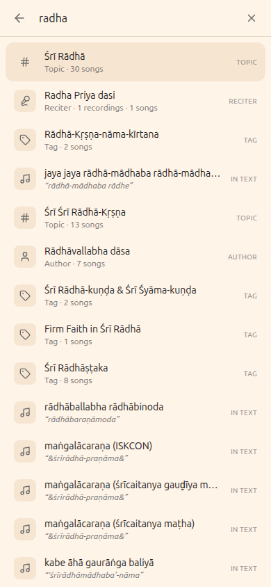
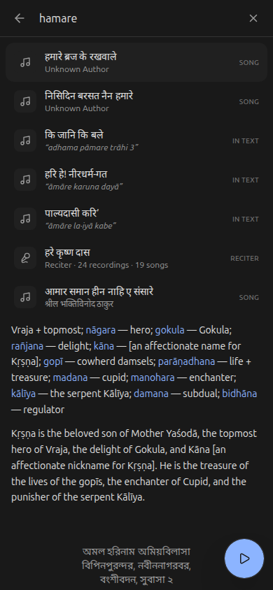
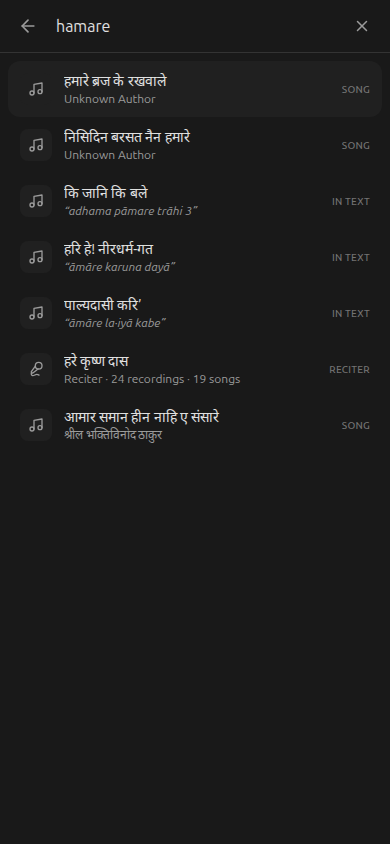

# Screen — Search

**Spec version:** 10

**Figma frames:** `Search`, `Search-1`.

**Prior art:** `../../search-benchmark/` — fuzzy + semantic (Chroma / sqlite-vec) spikes, and
`search-database.csv` (real user search attempts, e.g. "krishna vimostottra" →
*Śrīkṛṣṇera Viṁśottara-śatanāma*) usable as fuzzy-match ground truth.

## Purpose

Fast, forgiving lookup of a song by title or author across the whole catalog, fully offline. The
search bars already present (decoratively) on Home/Library and the Search tab all resolve here.
Kirtan titles are transliterated Sanskrit/Bengali, so **fuzzy, diacritic-insensitive matching is
essential** — users type "govinda" for "gōvinda", "vimostottra" for "viṁśottara".

## Data bindings

- Indexes the [Manifest](../data/manifest.md) only — never full songs. Matches against:
  - every `titles[]` entry (all scripts, so a user can match Roman *or* native script), and
  - the resolved author name (`author_uid` → derived Author).
- A result resolves to a `uid`; tapping opens [song-detail](song-detail.md).
- **Reciters** (web palette) — the performing artists on `audio_files[].artist`, distinct from a
  song's composing author. Emitted as `type: 'reciter'` entries and
  resolving to **`/tracks?artist=<name>`** — a reciter is a performer, so the useful destination is
  their *recordings* ([tracks](tracks.md)), not the songs those takes belong to.

## Matching rules (tier 1 — fuzzy, required)

- **Normalize** query and target: lowercase, strip diacritics (ā→a, ṁ→m, ś→s), collapse
  whitespace/punctuation. Match on the normalized forms so accents and transliteration variants are
  forgiven.
- **Fold transliteration-equivalent letters** (Gauḍīya/Bengali romanization treats these as one):
  **v↔b** (`madhava`↔`madhaba`, `viṁśottara`↔`biṁśottara`) and **j↔y**. Folding these at normalize
  time measurably lifts recall (web: +several points) — adopt on all platforms for parity.
- **Rank**: exact/prefix hits first, then substring, then fuzzy (edit-distance / token overlap).
  Author matches rank below title matches. Cap and order by score.
- Match against all title scripts so native-script queries also work.
- Evaluate quality against `search-database.csv` (the recorded attempts should return their intended
  song in the top results).

## Semantic search (tier 2 — optional, later)

On-device semantic search (the `search-benchmark/sqlite` sqlite-vec + gte-small spike) is a **later
enhancement**, not required for this slice. Keep the search interface abstracted so a semantic tier
can layer behind the same result list.

**Known tier-1 limitation:** hard *metathesis* cases — letters transposed inside a token
(`vimostottra` for `viṁśottara`, `asktam` for `aṣṭakam`) — are not reliably matched by
normalize+edit-distance without hurting precision. The distinctive token typed alone still hits;
the noisy full query is the semantic tier's job. Keep tier-1 conservative (precision over recall).

## Layout & regions

- **Search field** (top) — autofocus on the Search tab; live results as the user types.
- **Results list** — reuses the [songs-list](songs-list.md) row (title in `listLanguage` + author +
  audio badge), ordered by score.
- **Idle state** — before typing: optionally recent/suggested (defer; empty is fine).
- **No-results state** — a clear "no matches" message.

## Presentation — one surface, two shapes (web)

The palette is **one component with two presentations**, chosen purely by viewport width at the
app's single `md` breakpoint (**768 px**) — the same breakpoint that switches the sidebar into a
drawer and turns on the mobile top bar ([`navigation.md`](navigation.md)). There is no second
component and no JavaScript branch for the layout: a device-width media query decides it, so the
first paint is already correct and there is nothing to hydrate into.

### Desktop / tablet (`≥ 768 px`) — centered command palette

Unchanged from v2: a `max-w-xl` card, 12 vh from the top, over a dimmed blurred backdrop; rounded
`2xl` corners, a border and a shadow; the results region caps at `55 vh`; the footer keyboard hints
(`⏎ open`, `↑↓ navigate`, result count) and the `Esc` key cap are shown; clicking the backdrop
dismisses.

### Mobile (`< 768 px`) — full-screen search page

Below the breakpoint the palette is **not a modal card, it is a page**: edge to edge, no outer
margin, no rounded corners, no border, no shadow, no dimmed backdrop behind it (there is nothing
behind it to dim). It reads like a dedicated mobile search screen.

- **Two layers, two jobs — the surface is *not* one box.** "Full screen" is two separate
  requirements that resolve to two different heights, and collapsing them into one box is what
  produced the iOS accessory-strip leak (v10):

  | Layer | Height | Job |
  |-------|--------|-----|
  | **Panel** (interactive: header, input, results) | the **usable visual viewport** | Everything the reader touches has to be *reachable* — above the keyboard, never behind it. |
  | **Underlay** (opaque, non-interactive) | the **whole layout viewport, and past it** | Everything the reader *sees* has to be search — including the strip the OS paints its keyboard accessory bar over. |

  - **Panel — usable viewport, not `100vh`.** Sized to `100dvh`, so it tracks the browser's
    collapsing/expanding toolbars instead of the tallest-possible viewport that `100vh` freezes on.
    On top of that, while the surface is open it follows **`window.visualViewport`** (`height` +
    `offsetTop`, published as the CSS variables `--gk-search-viewport-height` /
    `--gk-search-viewport-top`): the on-screen keyboard shrinks the *visual* viewport but **not**
    `dvh`, so on iOS Safari a `dvh`-only panel hides its bottom half behind the keyboard. `offsetTop`
    is applied as the panel's top margin, because iOS pushes the page up around a focused input.
    Browsers without `dvh` fall back to `100vh` via `@supports`; browsers without `visualViewport`
    fall back to the `dvh` value.
  - **Underlay — coverage must not stop where the panel stops.** iOS draws the keyboard's
    password/autofill accessory bar **over the page**, not over browser chrome, so any part of the
    document below the visual viewport shows through it. The underlay is therefore a separate
    `aria-hidden`, `pointer-events: none` layer painted *behind* the panel in the same overlay, in
    the surface's own `--background`, and it is **one large-viewport (`100vh`) tall, offset by
    `--gk-search-viewport-top`** — `100vh` is the tallest the viewport can get (toolbars retracted),
    so it always reaches at least the bottom of the layout viewport, and the offset term carries it
    past that when iOS has scrolled the page up. **No keyboard or accessory height is ever named**:
    the coverage is structural, not a measurement of the OS.
  - The variables are read **only inside the mobile media query**, so nothing they publish can reach
    the desktop card, and the underlay is not rendered at all above `md` (there the dimmed backdrop
    is the point).

  The same phone (390×844, Shyam, a song reader underneath) with the usable viewport shortened to
  464 px — the band below the panel is where iOS floats its accessory bar and keyboard:

  | Coverage sized by the *usable* viewport (v9) | Coverage sized by the *layout* viewport (v10) |
  |---|---|
  |  |  |
- **Safe areas.** The header pads by `env(safe-area-inset-top)` and the results region by
  `env(safe-area-inset-bottom)`, so the input clears a notch/status bar and the last result clears
  the home indicator.
- **Regions.** A fixed header (back button + input + clear) and a **flexible** results region that
  takes exactly the remaining space and scrolls internally. The header is always visible; the
  desktop keyboard-hint footer is not rendered (its hints name physical keys).
- **Close affordance.** A leading **back arrow** (`Close search`), the convention for a full-screen
  mobile search surface — a mobile user has no backdrop to tap. A **clear** (`×`) button appears
  next to the input while the query is non-empty and returns focus to the input. `Escape` still
  closes, for a phone with a hardware/attached keyboard.

### Both presentations

- **Background scroll is locked while search is open** and restored on *every* exit path (close,
  result tap, route change, unmount). The lock writes only `overflow-y` **inline on `<body>`**,
  saves whatever inline value was there first, and is **reference-counted**, so it restores the page
  exactly as it found it and never clobbers an existing body style (`globals.css` sets
  `overflow-x: clip` on `body`, which must survive). Scroll position is preserved because the lock
  never moves the document. The results region additionally sets `overscroll-behavior: contain`, so
  flinging past the end of the list does not chain into the page behind it.
- **Focus** moves to the input via the input's **ref callback** — the input mounts only when the
  surface opens, and a ref callback runs synchronously during commit, still inside the user's tap.
  That is what makes iOS raise the keyboard; a `setTimeout` would land after the gesture and is not
  used.
- **Result semantics:** the input is a `combobox` and the results region a `listbox` of `option`
  rows with `aria-activedescendant` tracking the arrow-key selection, so the selection an arrow key
  moves is announced rather than being a purely visual highlight (focus never leaves the input).
- **Reduced motion:** the surface has no enter/exit animation in either presentation, so there is
  nothing for `prefers-reduced-motion` to remove.

## States

- **Empty query:** idle state (no results list).
- **No matches:** explicit empty message.
- **Offline:** fully functional — the index is the bundled manifest.

## Interactions

- Type → live-filter results (debounced).
- Tap result → [song-detail](song-detail.md) for that `uid`.
- The **Home** search affordance (and the dedicated Search tab) is the global title/author search
  and navigates/expands into this screen.
- **Do NOT hijack a Library search bar that already does real per-category filtering** (e.g. mobile
  Library filtering Songs/Authors/Topics/Books) — replacing that with global search is a regression.
  Only genuinely-decorative search affordances get wired to this screen.

## Per-platform notes

- **iOS:** a `SearchView` + `SearchViewModel` over the manifest; `SearchBar` component already exists.
- **Android:** a `SearchScreen` (Compose) + `SearchViewModel`; `SearchBar`/`LibrarySearchBar` exist.
- **Web:** a `/search` route (or expanding the header search box) filtering the embedded manifest
  client-side.
- All: normalization/ranking should live in one shared-per-platform helper so behavior matches.

## Verification

- **Visual:** matches `Search` / `Search-1` frames per platform.
- **Behavioral:** diacritic-insensitive queries return the right song (spot-check several rows from
  `search-database.csv`); native-script query matches; author query returns that author's songs;
  no-results state shows; tap → correct song; works offline.

## Change log

- **v10 (web)** — **The full-screen surface now actually covers the full screen: the opaque layer no
  longer stops where the keyboard starts.** Reported from real iOS Safari (Shyam, a song reader
  underneath): with the keyboard up, the strip between the last result and the keys — where iOS
  floats its password/autofill accessory bar — showed the **song page's blue Devanagari verse text**
  through it. Measured on the shipped build at 390×844 with the visual viewport shortened to 464 px:
  **32,394 of 148,200 pixels** (Shyam; 31,599 in Gaura) below the visual viewport belonged to the
  reader, and the band was *pixel-identical whether search was open or closed* — the surface painted
  nothing there at all.
  - **Root cause, and why it is a v9 blind spot rather than a typo.** v9 gave one box two jobs: the
    surface was sized to `--gk-search-viewport-height` so the panel would clear the keyboard, and
    that same box carried the opaque background. But iOS composites the accessory bar **over the
    page**, so the document is visible in exactly the region the visual viewport excludes. Sizing
    coverage by the *usable* viewport therefore guarantees a leak the moment the two viewports
    differ. `dvh` cannot help: it does not shrink for the keyboard, which is why v9 measured in the
    first place.
  - **Fix: split reachability from coverage** (see **Presentation → Two layers, two jobs**). The
    panel keeps the measured visual viewport (now via `height` + `margin-top` on the panel itself);
    a new `aria-hidden`, `pointer-events: none` **underlay** paints the same `--background` behind
    it, `100vh` tall plus `--gk-search-viewport-top`. `100vh` is the *large* viewport — the one v9
    called the wrong unit for content — and it is exactly the right unit for coverage, so the fix
    names no keyboard or accessory height and needs no device constants.
  - **Regression** (`e2e/search-ios-keyboard.spec.ts`): fakes `window.visualViewport` so the real
    `useSearchViewport` → CSS-variable path runs, then screenshots the band below it and reads every
    pixel back through a canvas — the same thing the reporter photographed, and blind to which
    element does the covering. It first asserts the band *does* show reader text with search closed,
    so a blank page cannot make it pass for nothing; then that with search open the band is a single
    colour equal to the panel's background, in **both themes**, across keyboard raise/dismiss/raise
    and a non-zero `offsetTop`. It also pins that the underlay must **not** stretch the interactive
    scroller: the results region still ends at the keyboard.
- **v9 (web)** — **On a phone the palette is a full-screen search page; on desktop it is the same
  centered card it always was.** A `max-w-xl` card floating 12 vh down a 390 px screen wastes the
  screen it is standing on: it showed ~4 results, kept a dimmed strip of a page nobody could read,
  and put the only dismissal (tap the backdrop) in the strip a thumb cannot reach. Below `md`
  (768 px) the same component now fills the viewport edge to edge — no margin, no rounded corners,
  no backdrop — with a back button, a fixed header and an internally scrolling results region. See
  **Presentation** above for the full rules; the parts worth calling out:
  - **The viewport is measured, not assumed.** `100dvh` handles the collapsing toolbars; the
    `visualViewport` variables handle the on-screen keyboard, which `dvh` does not track (this is
    the iOS Safari bug where the bottom half of a `dvh` surface sits behind the keyboard). Both are
    consumed only inside the mobile media query, which is what keeps the desktop card untouched.
  - **The scroll lock restores what it found.** It writes `overflow-y` inline on `<body>`, keeps the
    previous inline value, and is reference-counted — `body { overflow-x: clip }` (the rule that
    keeps `position: sticky` alive app-wide) must still be there afterwards. Every close path goes
    through the same unmount cleanup, so there is no path that leaks a locked page.
  - **The layout branch is CSS, not JavaScript.** One media query, no `matchMedia` state, so the
    server-rendered markup is already the right shape and there is no first-paint flash of a card
    on a phone.
  - Focus now comes from the input's ref callback instead of a 20 ms `setTimeout`, which is both
    less brittle and what lets iOS open the keyboard (the focus stays inside the tap gesture).
    `Escape` closes from anywhere via a document listener rather than only when focus is inside the
    surface, and a `routeChangeStart` listener closes it when navigation comes from somewhere else
    (a hardware back button), which is also what guarantees the scroll lock is released.
- **v8 (web)** — **Reciter names in the palette now follow `listLanguage` too, and the author
  renderings are de-duplicated.** Two follow-ups to v7:
  - **Reciters were the last romanized-only entity.** Their names (`audio_files[].artist`) are
    Gauḍīya devotional names, so they transliterate like a title — but the corpus stores them as a
    single romanized string. `pipeline/build_reciter_scripts.py` supplies a hand-authored IAST per
    performer and transliterates it to every Indic script with aksharamukha, **keeping non-Sanskrit
    tokens Latin** (sannyāsī initialisms `BV`/`BP`/`BR`, place qualifiers `(Bay Area)`/`(Florida)`/
    `(UK)`, `&`), into `src/data/reciter_names.json` keyed by artist code (the recording-uid
    prefix). `gen-markdown` attaches those `scripts` to each reciter entry (by code), and
    `services/reciterNames.ts` serves them to the tracks list as well. So a Bengali reader now sees
    `শ্রীল BV স্বামী প্রভুপাদ`, `রসিক দাসী`, `রাধিকা দাসী (Bay Area)`.
  - **`authorScripts` de-duplicated.** v7 copied each author's per-script names onto every one of
    their song rows (82 authors across 702 songs). Song entries now drop `authorScripts`; the palette
    builds an author-name → scripts map from the `author` entries (which already carry them) and
    looks a song's author up by its shared romanized name. Index raw 1.06 MB → 673 KB; gz 184 → 155
    KB (155 KB is dominated by the title `scripts`, not the authors). Matching and display are
    unchanged.
- **v7 (web)** — **Palette results now render in the reader's `listLanguage`, not always romanized.**
  The palette was the one title-showing surface that ignored the display-script setting (the song
  list, cards, detail, groups, home and mini-player all honor it via `pickScriptText` /
  `pickListTitle`). The cause was the data, not the component: `search-index.json` carried a Latin
  `label` only, so the palette had nothing else to show. Each entry that has script renderings
  (song, book, topic, author — not tag/reciter, which have none) now also carries a `scripts` map
  (`{Beng, Deva, …}`, Latin omitted since it is the `label`) and a song carries `authorScripts`;
  `SearchModal` displays `scripts?.[listLanguage] ?? label` (and the author likewise). **Matching is
  unchanged** — it still runs on the Latin label + the romanized query (v6), so only what the reader
  *sees* follows `listLanguage`. The index grows 22 KB → 184 KB gzipped (still one on-open fetch);
  an e2e test pins a Bengali reader getting Bengali titles. This closes a recurring class of bug:
  any Latin-only *derived* artifact (like the search index) silently ignores the script setting even
  when every component is correct — the fix is to carry the scripts in the data.
- **v6 (web)** — **Search now works in any supported script — by transliterating the query, not by
  indexing every script.** The index stays Latin (IAST); a query typed in Bengali, Devanagari,
  Telugu, Kannada, Malayalam, Gujarati, Oriya or Tamil is romanized to IAST on the fly and matched
  against the one Latin Duet index. This is ~a tenth the payload of shipping a per-script index
  (~900 KB each) and works in *both* directions the multi-script fix needed to: a reader typing
  their own script finds the song, without the corpus carrying nine extra copies of every line.
  - **Maps** are generated at build time from **aksharamukha** (the same engine that romanized the
    corpus, so a runtime romanization lines up with the indexed text by construction) by
    `pipeline/build_translit_maps.py` → `web/src/data/translit-maps.json` (8 KB, ~2 KB gzipped,
    bundled — the transliterator must run synchronously per keystroke, so it can't be a lazy fetch).
    The map carries only the alphabet: per script, each vowel, each **bare** consonant, the vowel
    each dependent sign (matra) stands for, the virama, and the anusvara/visarga/candrabindu marks.
  - **Assembler** (`services/translit.ts`, ~40 lines) applies the abugida rules the map omits: a
    consonant carries an inherent `a`; a following matra replaces it; a virama drops it (which is
    also how conjuncts fall out — क्ष walks to `k` + (virama: no vowel) + `ṣ` + `a` = `kṣa`). It
    detects the script from the first strong character and is a **no-op for Latin**, so it is safe
    and cheap on every query. Wired once inside `searchDuet`, so the palette and the URL rescuer
    both get it.
  - **Measured** on the corpus's own native titles run back through the actual assembler + Duet:
    **100% R@1** for Bengali, Devanagari, Telugu, Kannada, Malayalam, Gujarati and Oriya; **99.1%**
    for Tamil (its overloaded consonants carry aksharamukha's superscript-digit disambiguation,
    which mostly still matches). Content-line queries in native script work too. Retrieval is this
    high because Duet is fuzzy and its normalizer strips diacritics, so small romanization
    differences wash out. **Not covered:** Cyrillic (the corpus's Russian-transliteration rendering
    is alphabetic, not Brahmic — a separate small map, deferred), and typing in a script's *native
    digits* for a uid.
- **v5 (web)** — **Duet is now the matcher for both the palette and the URL rescuer, and verse
  content is searchable.** The tiered `scoreText` ranker is replaced by **Duet** (`services/duet.ts`),
  the joint-objective winner from the `search-lab/` benchmark: `min(R@1 title, R@1 content) = 86.6%`
  where `scoreText` was 65.8%, held back by title recall on the metathesis/compound misspellings it
  structurally cannot reach. Duet runs two retrieval paths — a fielded character-trigram + phonetic
  title index with a Levenshtein rerank, and a **per-line** content index (every verse line is its
  own document, aggregated to song by **max**, never pooled — pooling is the documented
  79.7%→23.4% collapse) — fused by max so a song wins by whichever field matched. The engine and its
  ~20 tuned constants are ported verbatim from the lab (validated top-5-identical on 20 queries) and
  should be treated as a unit.
  - **New index:** `scripts/gen-markdown.mjs` emits **`search-content.json`** — every song's IAST
    verse lines keyed by uid (702 songs, 15,552 lines, ~210 KB gzipped). Taken from the `Latn`
    `display_scripts`, the same field the `.md` twins use, which is already free of the pipeline's
    `[FLAG_HYPHEN_ALPHA]` sentinel that `source_text_master` carries. It is a **separate, lazily
    fetched** file: the palette loads it in the background on first open, so title/entity search is
    live instantly off the 22 KB `search-index.json` and content search lights up a moment later —
    nobody pays 210 KB just to jump to a song.
  - **Palette:** builds one Duet index over pages + entities (+ content for songs) and searches it;
    a song is now findable by a line of its text ("radhika charana renu" → *Rādhikā-caraṇareṇu*),
    not only its title.
  - **URL rescuer:** uses the same Duet matcher for its fuzzy pass, over **labels only** (a URL
    names a thing, it does not quote a line of one), gated by a score floor (1.5) and the same 1.15×
    ambiguity margin. Pass 1 (case-exact) is unchanged. All 25 resolver precision tests stay green:
    `/setings`→`/settings`, `/trackz`→`/tracks`, `/pronunciaton`→`/resources/pronunciation`,
    `/akrodha`→`/songs/N9` resolve; `/xyzzy`, `/jaya jaya`, `/songs/NA9` and `/arati` still 404.
  - **Still Latin-only:** both indexes carry romanized text only, so a query *typed* in Bengali or
    Devanagari is still unmatched (title labels and verse lines are IAST). The metathesis case
    `krishna vimostottra`→*biṁśottara* remains unsolved at rank 1 — Duet does not reach it either
    (it was the skeleton matcher `jaigopal`'s specialty in the lab). `scoreText`/`textCloseness` in
    `search.ts` are now unused by the app (only `normalizeSearchText` is, via Duet) but stay as
    tested utilities.
- **v4 (web)** — **The palette and the URL rescuer now search the same set.** They shared the
  `scoreText` ranker but not the data: the palette kept its own 12-entry page list while
  `urlResolver` had a shorter 8-route one that was *case-matched only, never fuzzy-matched*. So ⌘K
  found "Settings" from a typo while `/setings` 404'd, and `/resources/*` was unreachable from a URL
  at all. The list now lives once, as `NAV_ENTRIES` in `services/urlResolver.ts`, and the palette
  imports it (attaching icons by href).
  Also added a **typo tier**: every tier `scoreText` is confident about (exact/prefix/substring)
  requires the query to be literally *contained* in the target, which a misspelling never is —
  `/setings` scored 30.5 against a floor of 60. A normalized edit-distance similarity ≥ 0.8
  (`textCloseness`) is now promoted to the substring tier, then judged by the same floor **and the
  same 1.15× ambiguity margin**, so `/setings`, `/trackz` and `/pronunciaton` resolve while
  `/xyzzy`, `/jaya jaya` and `/bhaktivinoda` still 404 on purpose (the last two are genuine ties —
  a dozen songs at exactly 80.0 and a three-way tie at 60.0).
  **Known gap, not fixed here:** `search-index.json` labels are Latin-only (0 of 968 rows carry
  Indic text), so a Bengali/Devanagari title is unfindable in *either* path even though every song
  ships 10 script renderings. The multi-script matcher that would fix it
  (`buildSearchIndex`/`searchIndex`/`searchListings` in `search.ts`, plus `search-listings.json`)
  still exists and is tested but has **zero importers** — it was the removed `/search` page's engine
  (see v2). Wiring it up, or emitting all scripts into `search-index.json`, is the real fix.
- **v3 (web)** — Palette is now **universal**: finds pages/nav (with icons), songs, books, topics,
  authors, and tags — one flat ranked list, each row showing a type icon + type label. Data entities
  come from `/search-index.json` (emitted by gen-markdown.mjs) + hardcoded page entries; generic
  ranking via `search.ts` `scoreText`. Tags link to `/songs?tag=<tag>` (filter reads `/tag-index.json`).

- **v2 (web)** — Search is now a **centered command-palette modal** (`SearchModal.tsx`), opened by
  the sidebar Search button, the mobile header, or **⌘/Ctrl-K** from anywhere — not a full page. Same
  offline ranker (`services/search.ts`); the client-safe index is fetched once from
  `/search-listings.json` (emitted by `scripts/gen-markdown.mjs`, romanized author names included) so
  it never drags the fs repositories into the bundle. Arrow-key navigation + Enter to open; Esc/backdrop
  to close. The standalone `/search` **page was removed** — the modal is a superset and the single entry
  point.
- **v1** — Initial spec: offline fuzzy (diacritic-insensitive) search over the Manifest titles (all
  scripts) + author, ranked results reusing the song-list row; semantic search flagged as a later
  optional tier.
