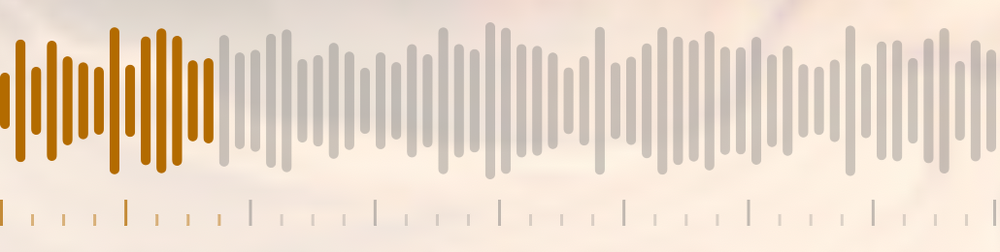
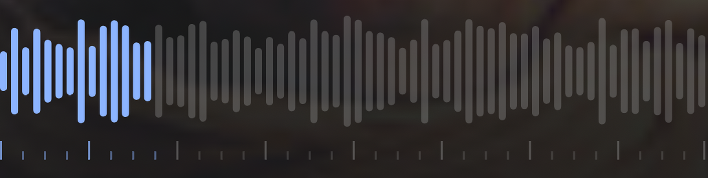
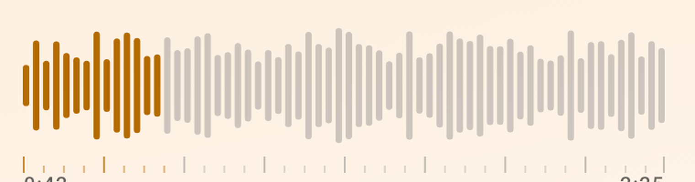
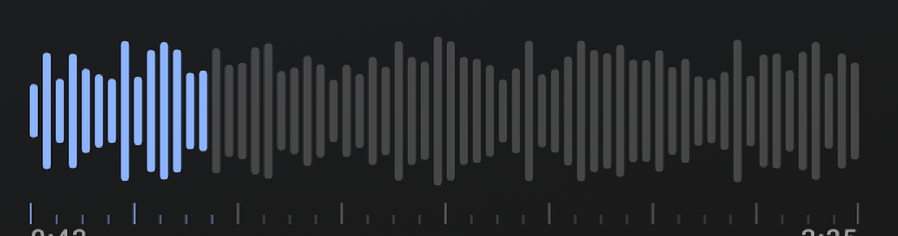

# Haptics — cross-platform feel

**Spec version:** 3 · **Status:** implemented on iOS and Android for the seek rail, the A–Z index,
the transport, the take picker, and search. Two proposed surfaces have no screen to attach to yet.

Haptics are the third channel, after color and motion, for saying *something happened*. This doc is
the shared vocabulary so the two native apps feel like one product rather than two apps that each
invented their own buzz. Web has no equivalent capability and is out of scope.

## The rule

**A haptic marks a state change the user caused.** If nothing changed, or the user didn't cause it,
it must stay silent. That single rule is what keeps a haptic app from becoming a noisy one, and it
is the thing to check first in review.

Corollaries worth stating, because they are where this usually goes wrong:

- **Never on arrival of content.** A list loading, audio buffering, or artwork resolving is not the
  user's doing. Feedback there reads as a malfunction.
- **Never as decoration.** A tick that does not correspond to a discrete change is noise, and noise
  trains people to turn haptics off system-wide — which costs the affordances that *were* earning
  their keep.
- **Silence is a valid design.** Most taps need nothing; the visual response is already immediate.
- **Never gate it behind an app setting.** Both platforms already expose a system-level haptic
  preference and honour it inside `performHapticFeedback` / the Taptic Engine; iOS additionally
  silences haptics in Low Power Mode. An in-app toggle would be a second, worse switch.
- **Accessibility gets one confirmation, not a stream.** VoiceOver, TalkBack, Switch Control, and
  keyboards commit one value at a time. Feeding them a continuous ladder is both wrong and
  unpleasant.
- **Gate the feel, never the behaviour.** When a haptic is conditional, only the haptic is
  conditional. Wrapping the *action* in the same condition silently changes what the app does.

## The vocabulary

`AppHapticEvent` (iOS `Utils/AppHaptics.swift`, Android `ui/haptics/AppHaptics.kt`). The cases are
semantic rather than named after platform constants, so call sites on the two platforms read alike.

| Event | Means | iOS |
|---|---|---|
| `selection` | a discrete choice was committed | `UISelectionFeedbackGenerator` |
| `toggleOn` | something started | `.soft` @ 0.6 |
| `toggleOff` | something stopped | `.soft` @ 0.4 |
| `tick` | one crisp step | `.light` @ 0.55 |
| `boundary` | a limit was reached or wrapped past | `.rigid` @ 0.8 |
| `warning` | the action ran and produced nothing | `UINotificationFeedbackGenerator(.warning)` |

### Android's API tiers

Android's haptic constants landed in waves, and **a constant the platform does not know is not
approximated — it is ignored, and the feedback silently does not happen.** So `appHapticType` tiers
down per event rather than branching once:

| Event | API 34+ | API 30–33 | API 27–29 | floor (24–26) |
|---|---|---|---|---|
| `selection` / `tick` | `SegmentTick` | `TextHandleMove` | `TextHandleMove` | `ContextClick` |
| `toggleOn` | `ToggleOn` | `Confirm` | `ContextClick` | `ContextClick` |
| `toggleOff` | `ToggleOff` | `GestureEnd` | `ContextClick` | `ContextClick` |
| `boundary` | `GestureThresholdActivate` | `Confirm` | `ContextClick` | `ContextClick` |
| `warning` | `Reject` | `Reject` | `LongPress` | `LongPress` |

`ContextClick` (API 23) is the floor: the oldest constant that still reads as a discrete tick rather
than a heavy buzz, available on every device this app supports (minSdk 24). `warning` deliberately
takes the heavier `LongPress` below API 30 instead of the floor, because it has to *feel* different
from a tick to carry any information.

Picking per tier rather than with one 34-or-nothing branch is what keeps the mid-band devices — still
a large share of the install base — from getting a silent app.

## Implemented — every surface at a glance

| Surface | Gesture / action | Event | Stays silent when |
|---|---|---|---|
| **Seek rail** | finger lands | grab | duration is 0 or unknown |
| | crossing a 1/32 detent | minor tick | still inside the same detent |
| | crossing a 1/8 detent | major tick | — |
| | arriving at 0:00 or the end | boundary | already held there |
| | seek commits | release | — |
| **A–Z index** | moving to a new letter | `selection` | the finger stays on one letter |
| | reaching the first/last letter **with songs** | `boundary` | — |
| **Transport** | play | `toggleOn` | loading or errored |
| | pause | `toggleOff` | loading or errored |
| | next / previous recording | `tick` | only one recording exists |
| | wrapping past either end | `boundary` | only one recording exists |
| **Take picker** | committing a different recording | `selection` | re-picking the one already playing |
| **Search** | the query stops matching anything | `warning` | it was already empty; or the query is blank |

Nothing in the app fires on content *arriving* — a list loading, audio buffering, artwork resolving.
That is never the user's doing, and feedback there reads as a malfunction.

### The seek rail (player.md v16)

The rail's ruler *is* the haptic ladder: a short mark every 1/32 of the recording, a tall one every
1/8, and a tick as the finger crosses each, so the mark under the finger is the mark it feels.

| Moment | iOS | Android (API 34+) | below 34 |
|---|---|---|---|
| Finger lands on the rail | `.rigid` @ 0.7 | `GestureThresholdActivate` | `ContextClick` |
| Minor detent (1/32) | `UISelectionFeedbackGenerator` | `SegmentFrequentTick` | `TextHandleMove` → `ContextClick` |
| Major detent (1/8) | `.light` @ 0.55 | `SegmentTick` | `TextHandleMove` → `ContextClick` |
| 0:00 or the end | `.soft` @ 1.0 | `GestureEnd` | `ContextClick` |
| Seek commits | `.soft` @ 0.6 | `GestureEnd` | `KeyboardTap` |

Shared arithmetic (iOS `ScrubHapticLadder`, Android `scrubTick`), unit-tested on both. Ticks are
rate-limited to 18 ms so a flick notches instead of rattling; boundaries fire on arrival, not while
held. Full contract in [`../screens/player.md`](../screens/player.md).

#### The ruler up close

The ruler is the only *visible* part of the whole haptic system, and at phone scale it is a few
pixels tall — the full-screen captures in player.md do not show it. These are 2× crops of the rail
from those same `R8` fixtures at 0:42 of 3:07, so the played/unplayed split is the same one the
screenshots show.

Read left to right: **tall marks every 1/8** of the recording, **short marks every 1/32**, both
taking the played (highlight) or unplayed (neutral) color of the bars above them. Those marks are
exactly the ladder the actuator ticks on.

| | Gaura | Shyam |
|---|---|---|
| **iOS** |  |  |
| **Android** |  |  |

The two platforms draw the same geometry from the same seed, which is why the silhouettes match; the
Android crop is narrower because its capture is a smaller device raster, not because the rail differs.

### The A–Z scroll index

`selection` per letter, and `boundary` on the **first or last letter that actually has songs** —
the index names every letter, so feeling "the end" at Z when the last real section is M would be a
lie. Decision in `AlphabeticalIndexHaptics.tick` / `alphabeticalIndexTick`.

iOS previously built a fresh `UIImpactFeedbackGenerator` per letter *inside* the drag handler and
never called `prepare()`, which is the documented way to get late, inconsistent haptics — the engine
spins up cold on each tick. It now holds prepared generators and warms them once per gesture.

### The transport

| Action | Event |
|---|---|
| Play | `toggleOn` |
| Pause | `toggleOff` |
| Next / previous recording | `tick` |
| Wrapping past either end of the recording list | `boundary` |

Play/pause reads the state *before* the toggle flips it, so the feel matches the transition the user
asked for. The wrap case earns its place: the transport already wraps, and nothing else tells you
you have come back around to the first recording except reading the title.

### The take picker

`selection` on committing a different recording. Re-picking the recording already playing is
**silent** — nothing changed. Only the feel is conditional; the selection itself still runs, so
re-tapping still restarts the take exactly as before.

### Search

Search is incremental — there is no submit — so the meaningful event is not "a query was entered"
but **"the query stopped matching anything"**. `warning` fires on the *transition into* the empty
state and not again while it stays there; firing per keystroke would rattle. A blank query is `idle`,
not `empty`: it is not a result of anything the user searched for.

This is the one genuinely informational haptic in the set — it tells you the search ran and found
nothing, which is otherwise indistinguishable from it not having run.

## Proposed — no surface yet

- **Pull-to-refresh / over-scroll.** `boundary` on crossing the refresh threshold, once, on crossing
  rather than while held. Neither platform has pull-to-refresh today.
- **Destructive and irreversible actions.** `warning` on the confirm step, not on opening the dialog.
  Offline download and delete are a later slice (player.md, "Per-platform notes"), so there is
  nothing destructive in the app to attach this to yet.

## Pairing haptics with motion

A haptic lands when it agrees with what the eye sees; the two are one event, not two.
[`../screens/theme.md`](../screens/theme.md) already asks each screen for **one** principal
expressive focal element, and that element is the one that should carry feel.

- **Co-time them.** The tick belongs at the frame the animation commits, not at gesture start and
  not at animation end. A tick that leads its animation reads as a glitch.
- **The player's wavy↔flat scrubber morph** (theme.md "Motion") is the focal element and marks
  play/pause; the transport's toggle feels fire on the same state read that drives the morph, so the
  two channels describe one event.
- **Springs, not eases, where a haptic is involved.** A spring settling gives the finger something to
  agree with. On Android this is `MotionScheme.expressive()`; on iOS, `.snappy`/`.bouncy`.
- **Reduce Motion does not imply reduce haptics.** They are separate system preferences and each is
  honoured on its own. When motion is suppressed the haptic often becomes *more* valuable, because
  it is carrying feedback the animation no longer is — so do not helpfully disable both.

## Verification

The decision logic is pure and unit-tested on both platforms — `AppHapticsTests` / `AppHapticsTest`
and `ScrubHapticsTests` / `ScrubHapticsTest`. That covers *whether* a haptic fires, which is the part
that regresses into either a dead app or a noisy one, plus the API tiering, which regresses silently.

What cannot be asserted in a unit test is whether it **feels** right, so every slice needs a pass on
real hardware: **the simulator and emulator have no actuator**, and Android's API 34+ segment
constants are exactly the ones that no-op there and on older phones.

Minimum device check: one iPhone, one API 34+ Android phone, and one below 34 — the last to confirm
the fallbacks fire rather than going silent.

## Change log

- **v3** — Added the at-a-glance surface table and 2× close-ups of the detent ruler in both palettes
  on both platforms. The ruler is the only visible part of the system and is a few pixels tall at
  phone scale, so the full-screen captures in player.md do not actually show what shipped.
- **v2** — Built the vocabulary out into a shared `AppHapticEvent` layer on both platforms with
  per-event API tiering down to a `ContextClick` floor (the previous seek-rail fallbacks stopped at
  `TextHandleMove`, leaving API 24–26 silent). Implemented the A–Z index repair and its ends-of-list
  boundary, transport toggles and the recording wrap, take-picker selection, and the empty-search
  warning. Recorded that pull-to-refresh and destructive actions have no surface in the app yet, and
  that search has no submit event to mark.
- **v1** — Established the vocabulary and the "marks a state change the user caused" rule from the
  seek rail's implementation (player.md v16), and proposed the A–Z index repair, transport, take
  picker, pull-to-refresh, search, and destructive-action slices.
